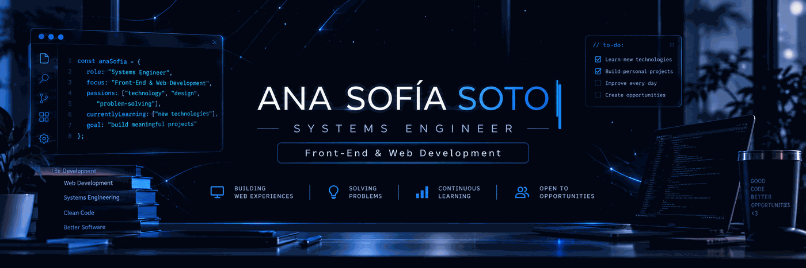

  

## 👩‍💻 About Me

I'm a **Systems Engineer** focused on **Front-End & Web Development**, interested in building functional, intuitive and well-structured digital solutions.

💻 I enjoy working across the web stack, from creating interfaces with **React & JavaScript** to building APIs with **Python & FastAPI**.

🧠 My background also includes **software development, databases, programming and problem-solving**, giving me a broader engineering perspective beyond Front-End.

🚀 I'm currently strengthening my skills through continuous learning and building projects for my professional portfolio.
 

## 🛠️ Tech Stack

### Front-End

  

### Back-End & Databases

  

### Other Languages

  

### Development Tools

  

 

## 🚀 Featured Projects

### 🛡️ Anti-Fraud Management System
Web-based system developed to support supervision, anti-fraud control and commercial performance evaluation.

**Tech:** React · JavaScript · Tailwind CSS · Python · FastAPI · SQLite

### 🌐 Personal Portfolio
My professional portfolio focused on showcasing my projects, technical skills and growth as a Systems Engineer.

**Tech:** JavaScript · HTML · CSS
 

## 📚 Currently Learning

- 🌐 Advanced Web Development — HTML5, CSS3, JavaScript, AJAX, PHP & MySQL
- 📊 Data Analysis — From fundamentals to advanced concepts
- 🛠️ Technical Support — Corporate computer environments
- 🚀 Building new projects to strengthen my development portfolio
 

## 🤝 Let's Connect

  

I'm open to connecting with developers, collaborating on projects and exploring opportunities in **Front-End & Web Development**.
